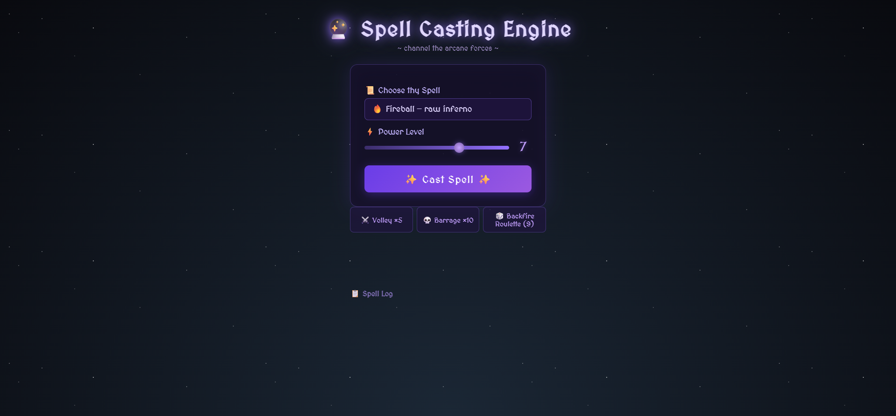
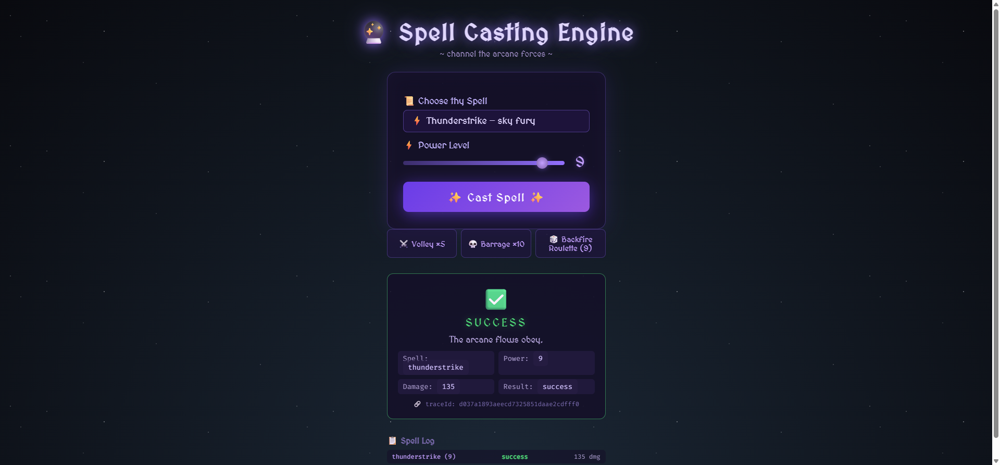
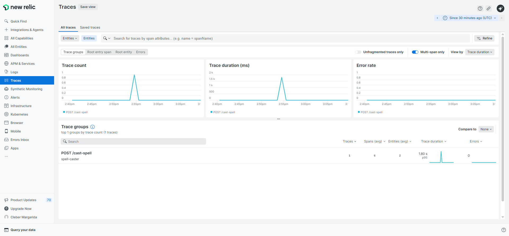
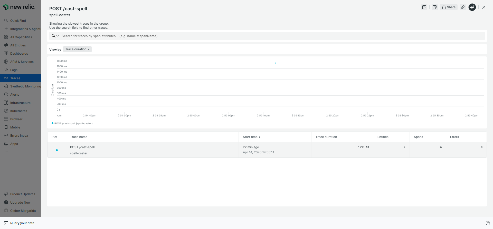
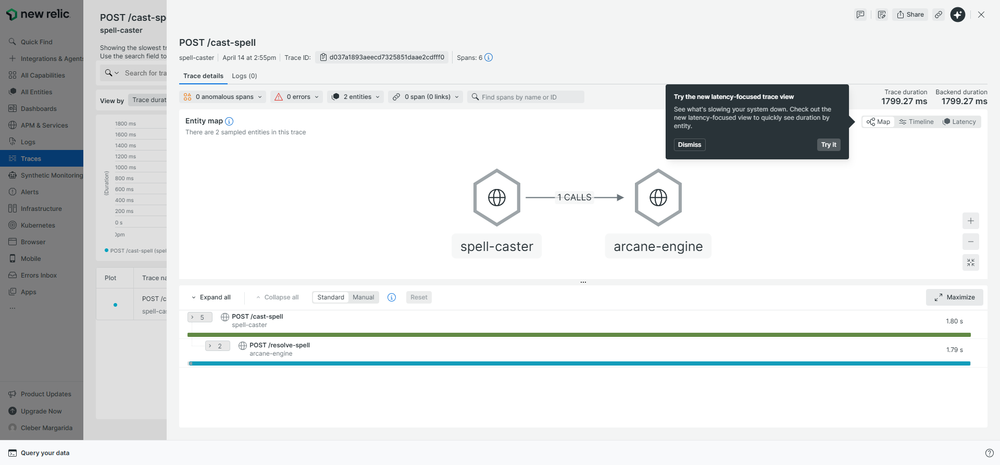
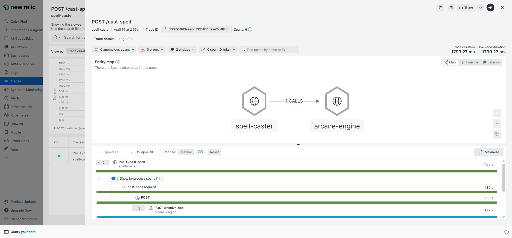
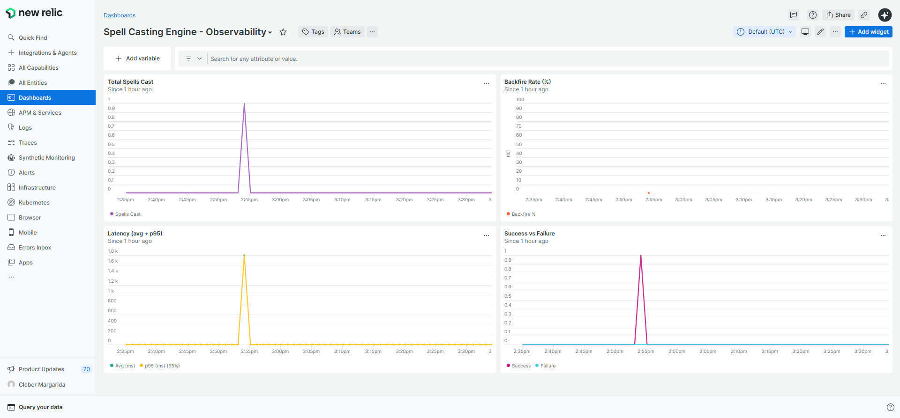

# 🔮 Spell Casting Engine

A distributed observability POC disguised as a magic system. Two .NET 10 microservices, a PostgreSQL database, and a browser UI — fully instrumented with OpenTelemetry and exporting traces + logs to New Relic.

---

## How it works

### Architecture

```
Browser (localhost:3000)
        │  HTTP POST /api/cast-spell
        ▼
┌─────────────────┐
│   nginx (3000)  │  ← static frontend + reverse proxy
└─────────────────┘
        │  HTTP POST /cast-spell   ← proxied to port 8080
        ▼
┌─────────────────┐
│  spell-caster   │  .NET 10 · port 8080
│  (service 1)    │  Entry point. Receives the request, opens a trace span,
│                 │  then calls arcane-engine to resolve the outcome.
└─────────────────┘
        │  HTTP POST /resolve-spell  ← W3C traceparent header propagated
        ▼
┌─────────────────┐
│  arcane-engine  │  .NET 10 · port 5000 (internal only)
│  (service 2)    │  Rolls the dice, determines outcome, simulates latency,
│                 │  persists the spell to Postgres, returns result.
└─────────────────┘
        │  SQL INSERT
        ▼
┌─────────────────┐
│   PostgreSQL    │  port 5432 (internal / exposed for local debugging)
│   (spells DB)   │  One table: spells (id, spell_type, power, result, damage, created_at)
└─────────────────┘

Both services ──OTLP──► New Relic (https://otlp.nr-data.net:4318)
```

---

## The Distributed Trace

Every spell cast produces **exactly 3 spans** in New Relic Distributed Tracing:

| # | Span name | Service | Type | What it covers |
|---|-----------|---------|------|---------------|
| 1 | `POST /cast-spell` | spell-caster | auto (AspNetCore) | Entire inbound HTTP request lifetime |
| 2 | `cast-spell.request` | spell-caster | manual | Business logic + outbound call to arcane-engine |
| 3 | `POST /resolve-spell` | arcane-engine | auto (AspNetCore) | Inbound request received by arcane-engine |
| 4 | `arcane-engine.resolve-spell` | arcane-engine | manual | Dice roll + latency simulation |
| 5 | `db.persist-spell` | arcane-engine | manual | SQL INSERT into PostgreSQL |

> **Why manual spans for Postgres?** `Npgsql.OpenTelemetry` auto-instrumentation would add extra spans we don't control. By creating `db.persist-spell` manually with `activitySource.StartActivity(...)`, we own the span name, attributes, and timing precisely.

### Trace Context Propagation

The W3C `traceparent` header ties spans from both services into one trace:

1. `spell-caster` starts a trace and `AddHttpClientInstrumentation()` automatically injects `traceparent` into the outbound HTTP request to arcane-engine.
2. `arcane-engine`'s `AddAspNetCoreInstrumentation()` reads the same `traceparent` header and continues the trace, making all its spans children of spell-caster's root span.
3. New Relic sees one unified waterfall — no manual propagation code needed.

---

## Spell Outcome Logic

Outcomes are determined in `arcane-engine` using a dice roll (`Random.Shared.NextDouble()` → a float between 0 and 1):

```
Power > 8  AND  roll < 0.30  →  backfire   (damage = 0, spell hurts the caster)
Power >= 7 AND  roll < 0.20  →  critical   (damage = power × 20)
anything else                →  success    (damage = power × 15)
```

Latency is simulated with `Task.Delay(Random.Shared.Next(100, 2001))` — every spell takes between 100ms and 2 seconds to "resolve", which keeps the latency charts in New Relic non-trivial.

---

## Observability Stack

### OpenTelemetry

Both services use the same OTel setup pattern:

```csharp
builder.Services.AddOpenTelemetry()
    .ConfigureResource(r => r.AddService(ServiceName))
    .WithTracing(t => t
        .AddSource(ServiceName)         // capture manual spans
        .AddAspNetCoreInstrumentation() // auto-span per HTTP request
        // spell-caster also adds: .AddHttpClientInstrumentation()
    )
    .WithLogging()      // OTel log pipeline (not just traces)
    .UseOtlpExporter(); // unified OTLP export — one config for traces + logs
```

`UseOtlpExporter()` reads three environment variables automatically:

| Env var | Value used here | Purpose |
|---------|----------------|---------|
| `OTEL_EXPORTER_OTLP_ENDPOINT` | `https://otlp.nr-data.net:4318` | New Relic OTLP ingest URL |
| `OTEL_EXPORTER_OTLP_PROTOCOL` | `http/protobuf` | Wire format (Protobuf over HTTP, not gRPC) |
| `OTEL_EXPORTER_OTLP_HEADERS` | `api-key=<NRAL key>` | Auth — must be a License/Ingest key, **not** a User API key |

### Serilog

Log output is structured JSON written to stdout (Docker reads it from there):

```csharp
builder.Host.UseSerilog((context, config) => config
    .WriteTo.Console(new CompactJsonFormatter()) // machine-readable JSON per line
    .Enrich.WithSpan());                         // injects @tr and @sp fields
```

`.WithSpan()` from `Serilog.Enrichers.Span` stamps every log line with the currently active OTel span's trace ID (`@tr`) and span ID (`@sp`). New Relic uses these fields to link log entries directly to spans in the trace waterfall.

### New Relic Span Attributes

Every spell span carries custom attributes you can query with NRQL:

| Attribute | Example value | Set by |
|-----------|--------------|--------|
| `spell.type` | `fireball` | both services |
| `spell.power` | `9` | both services |
| `spell.result` | `backfire` | arcane-engine |
| `spell.damage` | `0` | arcane-engine |

Example NRQL queries:
```sql
-- Backfire rate by spell type
SELECT percentage(count(*), WHERE spell.result = 'backfire') 
FROM Span WHERE spell.type IS NOT NULL 
FACET spell.type SINCE 1 hour ago

-- Average damage for critical hits
SELECT average(spell.damage) FROM Span WHERE spell.result = 'critical' SINCE 1 hour ago

-- Latency distribution
SELECT histogram(duration.ms, 10, 20) FROM Span 
WHERE name = 'arcane-engine.resolve-spell' SINCE 1 hour ago
```

---

## Running it

### Prerequisites

- Docker Desktop (with Compose)
- A New Relic License key (NRAL format — from Account Settings → API Keys → Ingest/License)

### Setup

```bash
# Copy the env template and fill in your key
cp .env.example .env
# Edit .env and set OTEL_EXPORTER_OTLP_HEADERS=api-key=YOUR_NRAL_KEY

# Start the full stack
docker compose up --build -d
```

Services start in order: PostgreSQL (health-checked) → arcane-engine → spell-caster → frontend (nginx).

### Using the frontend

Open **http://localhost:3000** in your browser:

- **Choose thy Spell** — pick a spell type from the dropdown
- **Power Level** — drag the slider (1–10); higher power = more damage but also higher backfire risk
- **Cast Spell** — fires a single POST and shows the result with flavor text and the trace ID
- **Volley ×5 / Barrage ×10** — rapid-fire random spells for quick load generation
- **Backfire Roulette** — always fires power 9, maximising the chance of a backfire

The trace ID shown after each cast can be pasted directly into New Relic's trace search.

### Simulating a DB failure

```bash
# In .env, add or change:
SIMULATE_DB_FAILURE=true

docker compose up -d --force-recreate arcane-engine
```

This causes `arcane-engine` to throw after the outcome is determined but before the DB INSERT, producing error spans and error logs visible in New Relic.

Reset with `SIMULATE_DB_FAILURE=false` and recreate again.

### Direct API access

```bash
curl -X POST http://localhost:8080/cast-spell \
     -H "Content-Type: application/json" \
     -d '{"spellType":"voidbeam","power":9}'
```

---

## Project structure

```
spell-casting-engine/
├── spell-caster/
│   ├── Program.cs          # Entry-point service: POST /cast-spell
│   ├── spell-caster.csproj
│   └── Dockerfile
├── arcane-engine/
│   ├── Program.cs          # Business logic service: POST /resolve-spell
│   ├── arcane-engine.csproj
│   └── Dockerfile
├── frontend/
│   ├── index.html          # Single-page spell-casting UI
│   └── nginx.conf          # nginx config: serves HTML + proxies /api/ → spell-caster
├── infra/
│   └── init.sql            # PostgreSQL schema (runs automatically on first start)
├── docker-compose.yml      # Orchestrates all 4 containers
├── .env                    # Local secrets (gitignored) — OTLP endpoint + key
├── .env.example            # Template for .env
└── README.md               # This file
```

---

## Screenshots

### Frontend — Idle

The spell-casting UI at `http://localhost:3000`. Pick a spell, set the power level, and hit Cast.



### Frontend — Cast Result

Thunderstrike at power 9 — SUCCESS, 135 damage. The trace ID links directly to New Relic Distributed Tracing.



### New Relic — Distributed Tracing

The Distributed Tracing page showing the `POST /cast-spell` trace group (6 spans across 2 entities).



### New Relic — Trace Group

Clicking into the trace group reveals individual traces with duration, entity count, and span count.



### New Relic — Trace Waterfall

The entity map shows `spell-caster → arcane-engine`, and the waterfall displays the full span hierarchy.



### New Relic — Expanded Waterfall

All spans expanded: `POST /cast-spell` → `cast-spell.request` → `POST` (HttpClient) → `POST /resolve-spell` → `arcane-engine.resolve-spell` → `db.persist-spell`.



### New Relic — Trace Spans

Span detail view showing custom attributes (`spell.type`, `spell.power`, `spell.result`, `spell.damage`) on each span.


### New Relic — Dashboard

Four NRQL widgets: Total Spells Cast, Backfire Rate (%), Latency (avg + p95), and Success vs Failure.



### New Relic Links

- [Dashboard — Spell Casting Engine - Observability](https://one.newrelic.com/redirect/entity/Nzk0NDkwNHxWSVp8REFTSEJPQVJEfGRhOjEyMzkyNjAx)
- [Distributed Tracing](https://one.newrelic.com/distributed-tracing)

> These links require access to New Relic account **7944904**.

---

## Key design decisions

**Why no `Npgsql.OpenTelemetry`?**  
The auto-instrumentation package would inject its own spans for every SQL call. That's useful in production but would clutter the intentionally clean 3-manual-span design of this POC. `db.persist-spell` is created manually to keep full control over naming and attributes.

**Why `UseOtlpExporter()` instead of `AddOtlpExporter()`?**  
`UseOtlpExporter()` is the "unified" exporter that wires both the tracer provider and the logger provider to the same OTLP endpoint with one configuration block. `AddOtlpExporter()` only covers traces and requires separate setup for logs.

**Why a User API key for the dashboard and a License key for OTLP?**  
New Relic has two separate key types: License/Ingest keys authenticate data _into_ New Relic (OTLP, APM agents, etc.); User API keys (NRAK- prefix) authenticate _queries_ via NerdGraph. Mixing them up results in 403 errors.
